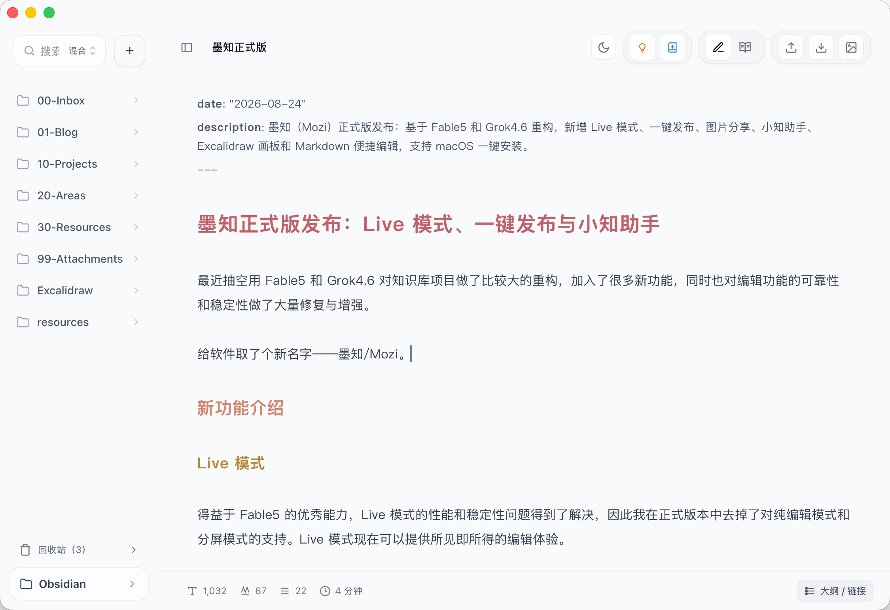

# Mozi

Chinese name: **墨知**.

[中文](./README.md) · [Development guide](./docs/DEVELOPMENT.en.md)

A local-first Markdown editor. Your vault is a folder of ordinary `.md` files. The official build writes in Live mode and can publish to WeChat drafts or Simple Blog in one click.

> Goal: a focused Markdown writing flow, lighter than Obsidian and smoother day to day than Typora for many writers.

<p align="center">
  
</p>

## Download

Grab the installer for your platform from [GitHub Releases](https://github.com/Yunz93/Mozi/releases).

### macOS

**Recommended: one-line install** (downloads, clears quarantine, and copies to Applications):

```bash
curl -fsSL https://raw.githubusercontent.com/Yunz93/Mozi/main/scripts/install-macos.sh | bash
```

Pin a release (optional):

```bash
RELEASE_TAG=v0.9.2 curl -fsSL https://raw.githubusercontent.com/Yunz93/Mozi/main/scripts/install-macos.sh | bash
```

Signed and notarized GitHub Releases should also open normally after you drag **墨知.app** into Applications. If Gatekeeper still blocks the app, run:

```bash
xattr -cr /Applications/墨知.app
```

If it is still in Downloads, use `~/Downloads/墨知.app` instead.

See [Development guide: macOS signing and notarization](./docs/DEVELOPMENT.en.md#macos-signing--notarization) for the CI secret setup.

### Windows

Run the `.exe` installer. If SmartScreen appears, choose **More info** → **Run anyway**. After install, **Settings → About** can check for newer GitHub Release builds.

## What's new

### Live mode

The official build keeps Live and Reading only. Source-only editing and split view are gone. Live renders as you type.

<p>
  
</p>

### One-click publish

- **WeChat Official Account drafts**: after you configure the account, Mozi sends a pre-rendered draft. Review it in WeChat's draft tools, then publish.
- **Simple Blog**: a companion site. Deploy it on Vercel, then push posts from Mozi. Set the repo URL, public site, and GitHub token under **Settings → Publishing**.

<p>
  
</p>

### Long-image share

Turn the current article into a single tall image for social posts.

<p>
  
</p>

### XiaoZhi assistant

Built-in local semantic search across the vault. Optionally point at an online model for Q&A with source citations.

<p>
  
</p>

### Excalidraw

Create a board from the sidebar. Obsidian `.excalidraw.md` files work too. Embed a preview with `![[drawing.excalidraw]]`.

<p>
  
</p>

### Slash inserts

Type `/` on an empty line to insert a table, callout, code fence, Mermaid diagram, or todo. Useful if you are still learning Markdown.

<p>
  
</p>

Repo: [github.com/Yunz93/Mozi](https://github.com/Yunz93/Mozi). Stars and forks welcome.

## Keyboard shortcuts

Defaults below; the full list lives in **Settings → Shortcuts**.

| Shortcut                                | Action                                             |
| --------------------------------------- | -------------------------------------------------- |
| `Cmd/Ctrl + S`                          | Save                                               |
| `Cmd/Ctrl + 0`                          | Settings                                           |
| `Cmd/Ctrl + 1` ~ `5`                    | Sidebar / outline / view mode / theme / AI enhance |
| `Cmd + Shift + F`                       | In-file search                                     |
| `Cmd + Shift + S`                       | Sidebar search                                     |
| `Cmd + Shift + K` / `L`                 | Open vault / locate current file                   |
| `Cmd + Shift + H`                       | Export PDF                                         |
| `Cmd/Ctrl + N` / `Cmd/Ctrl + Shift + N` | New note / new folder                              |
| `Cmd/Ctrl + Shift + Alt + N`            | New window (desktop)                               |
| `Cmd/Ctrl + W`                          | Close tab                                          |
| `Cmd/Ctrl + +` / `Cmd/Ctrl + -`         | Zoom UI text in / out                              |
| `Cmd/Ctrl + Shift + 0`                  | Reset UI text size                                 |
| `Cmd/Ctrl + Shift + -`                  | Clean unused attachments                           |
| `Escape`                                | Close search panel, dialog, or menu                |

## Publish to simple-blog

In **Settings → Publishing**, set:

- **Blog repository URL** (`https://github.com/owner/repo`, `git@github.com:owner/repo.git`, or `owner/repo`)
- **Public blog site URL** (used to write back `link` in frontmatter, e.g. `https://your-domain` or `your-app.vercel.app`)
- **GitHub token**: Fine-grained PAT with **Contents: Read and write** on the target repo

On publish, the app saves the note, sets `is_publish: true`, syncs `posts/` and images, rewrites image links to raw URLs, and pushes so Vercel redeploys.

Common frontmatter: `title`, `aliases`, `slug`, `link` (filled after publish), `status` (editorial only, not publish gate), `is_publish`. Empty `title` / `aliases` / `slug` can fall back to file name or title; the repo file name does not change when you edit `slug`.

## Publish to WeChat drafts

Same settings tab: **App ID** and **App Secret** (App Secret stays in secure local storage only). From the toolbar, pick the WeChat channel: confirm title, author, digest, and source URL; pick the cover at publish time; local images in the body upload automatically. First publish stores `wechat_draft_media_id`; republishing updates that draft. One account and single-article drafts for now; server-side calls may require allowlisting the outbound IP on the WeChat platform.

## License

[Apache License 2.0](./LICENSE)

## Acknowledgements

Mozi is built on many excellent open-source projects (in no particular order). The tables below list the main runtime dependencies used by the product; full versions and transitive deps live in `package.json` / `package-lock.json` and `src-tauri/Cargo.toml` / `Cargo.lock`.

### Desktop & UI

| Project                                                                                | Role                                        | License           |
| -------------------------------------------------------------------------------------- | ------------------------------------------- | ----------------- |
| [Tauri](https://tauri.app/) (API plus dialog / fs / process / shell / updater plugins) | Desktop shell, filesystem, dialogs, updates | Apache-2.0 OR MIT |
| [React](https://react.dev/)                                                            | UI                                          | MIT               |
| [Zustand](https://github.com/pmndrs/zustand)                                           | App state                                   | MIT               |
| [Vite](https://vitejs.dev/)                                                            | Frontend build                              | MIT               |
| [Tailwind CSS](https://tailwindcss.com/)                                               | Styling                                     | MIT               |
| [Lucide](https://lucide.dev/) (`lucide-react`)                                         | Icons                                       | ISC               |

### Editor

| Project                                                                                               | Role                                                | License |
| ----------------------------------------------------------------------------------------------------- | --------------------------------------------------- | ------- |
| [CodeMirror 6](https://codemirror.net/) (`@codemirror/*`, including Markdown and many code languages) | Live editing, highlighting, selection & decorations | MIT     |
| [Lezer Highlight](https://github.com/lezer-parser/highlight)                                          | Highlight tags                                      | MIT     |
| [@replit/codemirror-lang-csharp](https://github.com/replit/codemirror-lang-csharp)                    | C# language support                                 | MIT     |

### Markdown, preview & drawings

| Project                                                                     | Role                                        | License               |
| --------------------------------------------------------------------------- | ------------------------------------------- | --------------------- |
| [markdown-it](https://github.com/markdown-it/markdown-it)                   | Markdown parsing                            | MIT                   |
| [markdown-it-footnote](https://github.com/markdown-it/markdown-it-footnote) | Footnotes                                   | MIT                   |
| [markdown-it-task-lists](https://github.com/revin/markdown-it-task-lists)   | Task lists                                  | ISC                   |
| [GitHub Markdown CSS](https://github.com/sindresorhus/github-markdown-css)  | Preview base styles                         | MIT                   |
| [Shiki](https://shiki.style/)                                               | Code highlighting                           | MIT                   |
| [KaTeX](https://katex.org/)                                                 | Math                                        | MIT                   |
| [Mermaid](https://mermaid.js.org/)                                          | Diagrams                                    | MIT                   |
| [beautiful-mermaid](https://github.com/lukilabs/beautiful-mermaid)          | Mermaid rendering helpers                   | MIT                   |
| [DOMPurify](https://github.com/cure53/DOMPurify)                            | HTML sanitization                           | MPL-2.0 OR Apache-2.0 |
| [Excalidraw](https://excalidraw.com/) (`@excalidraw/excalidraw`)            | Freehand whiteboard editing & embed preview | MIT                   |
| [lz-string](https://github.com/pieroxy/lz-string)                           | Obsidian drawing compression                | MIT                   |
| [Turndown](https://github.com/mixmark-io/turndown)                          | HTML → Markdown                             | MIT                   |
| [js-yaml](https://github.com/nodeca/js-yaml)                                | YAML frontmatter                            | MIT                   |

### Export, PDF & document rendering

| Project                                                    | Role                  | License    |
| ---------------------------------------------------------- | --------------------- | ---------- |
| [PDF.js](https://mozilla.github.io/pdf.js/) (`pdfjs-dist`) | PDF preview           | Apache-2.0 |
| [html2canvas](https://html2canvas.hertzen.com/)            | Preview rasterization | MIT        |
| [html2pdf.js](https://ekoopmans.github.io/html2pdf.js/)    | HTML → PDF            | MIT        |
| [jsPDF](https://github.com/parallax/jsPDF)                 | PDF generation        | MIT        |

### Knowledge retrieval & optional AI

| Project / service                                                                                         | Role                                         | License / notes   |
| --------------------------------------------------------------------------------------------------------- | -------------------------------------------- | ----------------- |
| [Hugging Face Transformers.js](https://huggingface.co/docs/transformers.js) (`@huggingface/transformers`) | Built-in local embedding                     | Apache-2.0        |
| [Google Gen AI SDK](https://github.com/googleapis/js-genai) (`@google/genai`)                             | Optional Gemini client                       | Apache-2.0        |
| [Google Gemini](https://ai.google.dev/) / [OpenAI](https://openai.com/)-compatible APIs                   | Optional cloud or local (e.g. Ollama) models | Third-party terms |

On the Rust side, Mozi also uses [serde](https://serde.rs/), [reqwest](https://github.com/seanmonstar/reqwest), [uuid](https://github.com/uuid-rs/uuid), and crypto-related crates (such as `chacha20poly1305`, `hmac`, `sha2`) for secure local storage and desktop networking.

If you spot a missing credit, please open an issue or PR.
